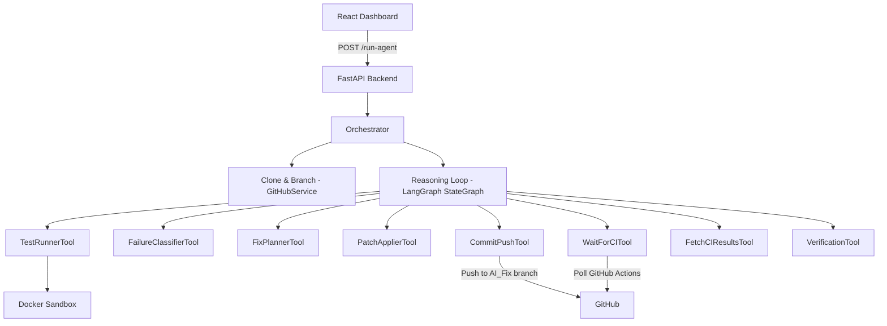

# Autonomous DevOps Agent – Self-Healing System

An autonomous DevOps agent with a React dashboard that detects, fixes, and verifies code issues via CI/CD pipelines.

## 🔗 Links

| Resource | URL |
|----------|-----|
| **Live Dashboard** | _TODO: add deployment URL_ |
| **LinkedIn Demo Video** | _TODO: add LinkedIn post URL_ |
| **GitHub Repository** | https://github.com/YOUR_ORG/Automated_Self_Healiing_System |

## 🏗 Architecture



```
├── backend/          # FastAPI Python server (API gateway + orchestration)
│   ├── app/
│   │   ├── orchestrator.py    # Drives the full CI-driven pipeline
│   │   ├── routes/agents.py   # REST endpoints: /run-agent, /status, /results, /stream
│   │   ├── services/github_service.py  # Clone, branch, commit, push
│   │   └── store.py           # In-memory run state management
├── frontend/         # React dashboard (Vite + TypeScript + Zustand)
│   └── src/
│       ├── components/        # RunForm, LiveProgress, RunSummary, ScoreBreakdown,
│       │                      # FixesTable, CITimeline
│       └── store/useRunStore.ts
├── agents/           # Autonomous agent modules
│   ├── reasoning_loop.py      # LangGraph StateGraph — 8-node CI-driven workflow
│   ├── heal_loop.py           # Legacy 4-agent heal loop
│   ├── run_memory.py          # Append-only memory for failure/fix/CI records
│   └── tools/                 # 8 registered tools (test_runner, classifier, etc.)
├── sandbox/          # Docker-based sandboxed code execution
├── shared/           # Shared schemas, results.json exporter, scoring
└── docker-compose.yml
```

## ⚙️ Tech Stack

| Layer | Technology |
|-------|-----------|
| Frontend | React 18, TypeScript, Vite, Zustand (state management) |
| Backend | Python 3.11+, FastAPI, Uvicorn |
| Agent Framework | **LangGraph** StateGraph (8-node CI-driven workflow) |
| Sandboxing | Docker (isolated code execution) |
| Git Integration | PyGithub + Git CLI |
| CI/CD Monitoring | GitHub Actions API (polling + log download) |
| Deployment | Docker Compose (local), Vercel/Railway (production) |

## 🐛 Supported Bug Types

| Bug Type | Description |
|----------|-------------|
| `LINTING` | Unused imports, style violations |
| `SYNTAX` | Missing colons, brackets, quotes |
| `LOGIC` | Incorrect conditions, wrong operators |
| `TYPE_ERROR` | Type mismatches, wrong argument types |
| `IMPORT` | Missing or circular imports |
| `INDENTATION` | Incorrect indentation levels |

## 🚀 Quick Start

### Prerequisites
- Python 3.11+
- Node.js 18+
- Docker & Docker Compose
- GitHub Personal Access Token

### Environment Setup

```bash
# Clone and configure
git clone <repo-url>
cd Automated_Self_Healiing_System
cp .env.example .env
# Edit .env with your GITHUB_TOKEN and GEMINI_API_KEY
```

### Run with Docker Compose

```bash
docker-compose up --build
```

### Run Individually

```bash
# Backend
cd backend && pip install -r requirements.txt
uvicorn app.main:app --reload --port 8000

# Frontend
cd frontend && npm install && npm run dev
```

### Access
- **Frontend Dashboard**: http://localhost:5173
- **Backend API**: http://localhost:8000
- **API Docs**: http://localhost:8000/docs

## 📖 Usage Examples

1. Open the dashboard at http://localhost:5173
2. Enter a **GitHub repository URL** (e.g., `https://github.com/org/repo`)
3. Enter your **Team Name** and **Leader Name**
4. Click **Start Run** — the agent will:
   - Clone the repo and create a branch (`TEAM_NAME_LEADER_NAME_AI_Fix`)
   - Discover and run all test files
   - Classify failures (LINTING, SYNTAX, LOGIC, etc.)
   - Generate and apply targeted fixes
   - Commit with `[AI-AGENT]` prefix and push
   - Monitor CI/CD pipeline and iterate (up to 5 times)
5. View results: Run Summary, Score Breakdown, Fixes Table, CI Timeline

## 📊 Scoring

| Component | Points |
|-----------|--------|
| Base score | 100 |
| Speed bonus (< 5 min) | +10 |
| Commit penalty (> 20 commits) | −2 per extra commit |
| **Maximum possible** | **110** |

## ⚠️ Known Limitations

- Requires a valid GitHub token with repo access
- CI monitoring assumes GitHub Actions (other CI providers not yet supported)
- LLM-based fix generation depends on API availability and rate limits
- Docker must be running for sandboxed test execution
- In-memory run state (not persisted across server restarts)

## 👥 Team Members

| Name | Role |
|------|------|
| _TODO: add team members_ | _role_ |

## 📝 Installation Instructions

1. Clone the repository
2. Copy `.env.example` to `.env` and fill in credentials
3. Install backend dependencies: `cd backend && pip install -r requirements.txt`
4. Install frontend dependencies: `cd frontend && npm install`
5. Start Docker for sandbox execution
6. Run backend and frontend (see Quick Start above)
